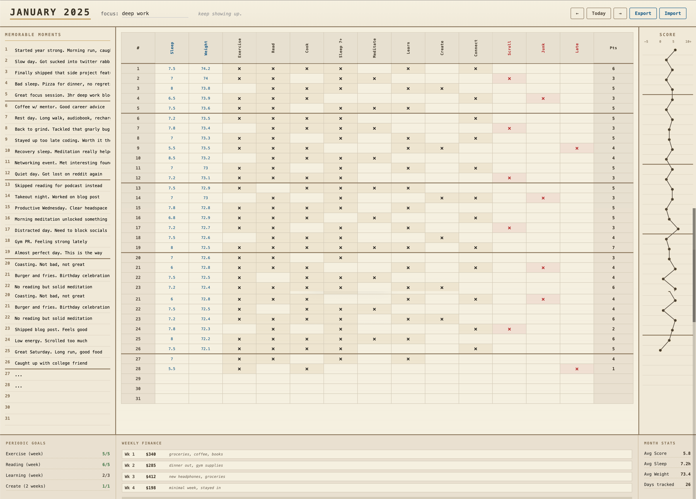

# habit-grid

minimal habit tracker inspired by analog bullet journals. 

One HTML file, runs locally, stores everything in your browser.



## what it does

- Track daily habits (positive and things to avoid)
- Log quantitative metrics (sleep, weight, whatever)
- Daily "memorable moments" journal
- Visual score graph that connects the dots
- Weekly finance tracking
- Periodic goals (weekly, biweekly, custom)
- Export/import your data as JSON

## setup

1. Clone the repo
2. Edit `config.json` with your habits
3. Open `index.html` in your browser

That's it. No build step, no dependencies.

## configuration

Edit `config.json`:

```json
{
  "title": "Habit Tracker",
  "motto": "stay present.",
  
  "habits": {
    "positive": [
      "Exercise",
      "Read",
      "Cook",
      "Sleep 7+",
      "Meditate"
    ],
    "avoid": [
      "Doomscroll",
      "Junk food"
    ]
  },

  "quantitative": [
    { "name": "Sleep", "key": "sleep" },
    { "name": "Weight", "key": "weight" }
  ],

  "periodicGoals": [
    { "name": "Exercise", "target": 5, "days": 7, "habit": "Exercise" },
    { "name": "Reading", "target": 5, "days": 7, "habit": "Read" }
  ],

  "weeklyFinance": true
}
```

### fields

| Field | Description |
|-------|-------------|
| `habits.positive` | Array of habits you want to build. Shows as black × when checked. |
| `habits.avoid` | Array of habits to avoid. Shows as red × when you slip (subtracts from score). |
| `quantitative` | Numeric fields to track. Each needs a `name` and `key`. |
| `periodicGoals` | Rolling goals. `target` is the count, `days` is the window, `habit` must match a positive habit name. |
| `weeklyFinance` | Set to `false` to hide the finance section. |

## data storage

Everything is stored in `localStorage`. Keys are prefixed with `tracker_`.

### export schema

When you click Export, you get a JSON file like this:

```json
{
  "tracker_2024_0": "{\"1\":{\"pos\":[true,false,true],\"neg\":[false],\"quant\":[7.5,72],\"summary\":\"started the year strong\"},\"fin_5\":{\"amt\":150,\"note\":\"groceries\"}}",
  "tracker_theme_2024_0": "deep work",
  "tracker_motto": "stay present."
}
```

Each month's data is stored under `tracker_YEAR_MONTH` (0-indexed months).

Daily data structure:
- `pos`: Array of booleans for positive habits
- `neg`: Array of booleans for avoid habits  
- `quant`: Array of numbers for quantitative fields
- `summary`: String for the day's memorable moment

Finance data is stored as `fin_DAY` within the month's data, where DAY is the Sunday's date.

### import

Click Import and select a previously exported JSON file. It merges with existing data.

## hosting

### local
Don't open in Finder — run a static server and visit http://localhost:8000.

```bash
python3 -m http.server 8000
# or
npx serve .
```

Opening via `file://` can break `fetch('./config.json')`. Once served and loaded,
the app runs offline from `localStorage`.

### vercel / netlify / github pages
Push to a repo and deploy. It's static files, works anywhere.

Note: Since data is in `localStorage`, it's tied to the domain. If you host it, your data stays on that domain's storage.

## Tips

- Export regularly. localStorage can be cleared.
- The score = (positive checks) - (avoid checks). Aim for consistency, not perfection.
- Sunday rows have thicker borders to mark weeks visually.
- The graph on the right shows your score trend. Dots connect automatically.

## Credits

Inspired by [@dominic.hartt](https://www.instagram.com/dominic.hartt/)'s analog tracking system.

## License

MIT. Do whatever you want with it.
